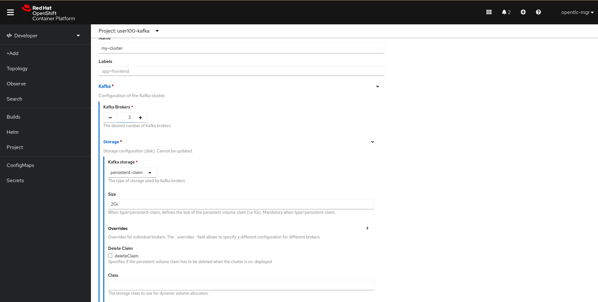
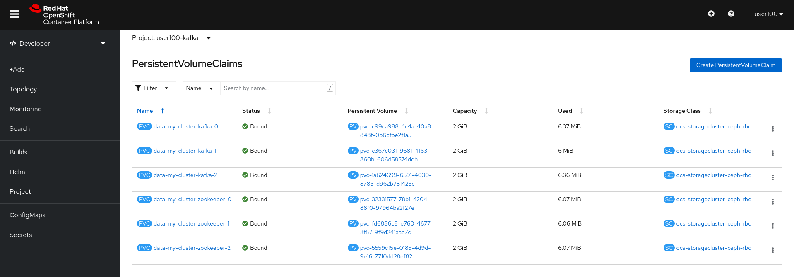

# Exercise 2 - Create a resilient Kafka cluster using ODF RBD and CruiseControl

## Table of Contents

- [Objective](#objective)
- [Diagram](#diagram)
- [Guide](#guide)
- [Takeaways](#takeaways)

# Objective

Getting to know better with partition allocation and logDirs persistency:
- Deploy a Kafka cluster using Openshift Data Foundation RBD as block backend for Kafka logDirs
- Understand parition allocation across Kafka nodes, In terms of failure and rebalancing 
- Use CruiseControl to get automatic rebalancing of paritions  

# Diagram


Make sure you connect to the cluster before starting this exercise! 

# Guide

## Step 1

 Click the `Add+` button in order to consume a resource from Openshift's marketplace. Pick the `Operator Backed` button in order to consume As-A-Service Kafka cluster. 

 Pick the `Kafka` resource and hit `Create` to start the deployment:  


## Step 2 

Hit the `Create` button in order to complete the installation (Make sure to seitch to `persistent-claim` to consume persistent storage for both `Kafka` and `ZooKeeper`): 



In Addition, switch to the `YAML View` section and add the following line under the `Storage` section:

```bash
storage:
  type: persistent-claim
  size: 2Gi
```

## Step 3 

Make sure your Kafka cluster was successfully installed and that you can see all of its compnents: 


## Step 4 

Veirfy that your Kafka cluster installation had been successful by using the `Project -> Pods` in the inventory: 


## Step 5

Ensure that the Kafka nodes are indeed using an persistent volumes for storing the Kafka logDirs by using `Project -> PVCs` on the left tab: 




## Step 7 

Having our Kafka cluster using emptyDirs means that on failure that Kafka cluster will have to replicate data on his own because **the underlying volume is gone**.
In this case we will count on Kafka's replication mechanism for replicating the data which can sometimes cause unwanted latency. 

To do so, we'll create a producer a Topic, a Producer and a Consumer that will send messages to one another. Producer --> Topic --> Consumer. 


We'll kill one of the Kafka nodes and see how it affects the offset being transfered between the producer and the consumer. 


## Step 8 

Let's create a Kafka topic using the `Add+ -> Operator Backed -> Kafka Topic -> Create` with the name `my-topic`: 


Make sure you leave the default values and hit the `Create` button. 

## Step 9 

Validate that the created Kafka topic was created successfuly by using `get kt` command: 

```bash 
$ oc get kt
                                                                                
NAME       PARTITIONS   REPLICATION FACTOR
my-topic   12           3
```

The Kafka topic was created with 12 parititions and replication factor of 3. 

## Step 10 

Let's create a Kafka user to interact with the created topic, move through the `KafkaUser` CR to verify that you understand how user management is handled in AMQ.

Copy this YAML, and paste it in `Add+ -> Operator Backed -> Kafka User` in order to create the `Kafka User` CR: 
 


Before you hit the `Create` button, switch to the `YAML View` section to verify you understand all the ACLs that is being given to our created user.

## Step 11

Now let's create a Kafka Producer that will write messages to our `my-topic` topic, and a consumer that will consume those messages via `Add+ -> YAML` 

```bash 
apiVersion: apps/v1
kind: Deployment
metadata:
  labels:
    app: hello-world-producer
  name: hello-world-producer
spec:
  replicas: 1
  selector:
    matchLabels:
      app: hello-world-producer
  template:
    metadata:
      labels:
        app: hello-world-producer
    spec:
      containers:
      - name: hello-world-producer
        image: strimzici/hello-world-producer:support-training
        env:
          - name: CA_CRT
            valueFrom:
              secretKeyRef:
                name: my-cluster-cluster-ca-cert
                key: ca.crt
          - name: USER_CRT
            valueFrom:
              secretKeyRef:
                name: my-user
                key: user.crt
          - name: USER_KEY
            valueFrom:
              secretKeyRef:
                name: my-user
                key: user.key
          - name: BOOTSTRAP_SERVERS
            value: my-cluster-kafka-bootstrap:9093
          - name: TOPIC
            value: my-topic
          - name: DELAY_MS
            value: "5000"
          - name: LOG_LEVEL
            value: "INFO"
          - name: MESSAGE_COUNT
            value: "5000"
```
Now let's create a Kafka consumer that will read messages from our `my-topic` topic via `Add+ -> YAML` :

```
apiVersion: apps/v1
kind: Deployment
metadata:
  labels:
    app: hello-world-consumer
  name: hello-world-consumer
spec:
  replicas: 1
  selector:
    matchLabels:
      app: hello-world-consumer
  template:
    metadata:
      labels:
        app: hello-world-consumer
    spec:
      containers:
      - name: hello-world-consumer
        image: strimzici/hello-world-consumer:support-training
        env:
          - name: CA_CRT
            valueFrom:
              secretKeyRef:
                name: my-cluster-cluster-ca-cert
                key: ca.crt
          - name: USER_CRT
            valueFrom:
              secretKeyRef:
                name: my-user
                key: user.crt
          - name: USER_KEY
            valueFrom:
              secretKeyRef:
                name: my-user
                key: user.key
          - name: BOOTSTRAP_SERVERS
            value: my-cluster-kafka-bootstrap:9093
          - name: TOPIC
            value: my-topic
          - name: GROUP_ID
            value: my-group
          - name: LOG_LEVEL
            value: "INFO"
          - name: MESSAGE_COUNT
            value: "5000"
```

## Step 13 

Verify that both consumer and producer works as expected by browsing their logs with `Topology -> hello-producer/consumer -> Resources - View Logs`, for example: 

### Producer Logs


### Consumer Logs


## Step 14 

Now after that we have our producer and consumer running as expected, open another Let's try to delete one of our Kafka pods and see what happens.

From the `Topology -> my-cluster-kafka -> Resources`, Click on one of the pods and hit `Actions -> Delete Pod`: 


Go back to you cosumer logs and verify that you don't see a disconnection as the pod attached the previously used persistent volume. 


## Step 15 

Delete the exercise's resources using:
*  `Topology -> hello-producer -> Delete Deployment`
*  `Topology -> hello-consumer -> Delete Deployment`
*  `Search -> Resources -> KafkaUser -> Delete`
*  `Search -> Resources -> Kafka -> Delete`

Make sure you have nothing in the `Topology View`.
*Question*: Were PVs deleted or not? If not, why? (Try to remember what we talked about for `Volume Reclamation Policies`) 

# Complete

Congratulations! You have completed the second exercise :)

---
[Click Here to return to the AMQ streams Workshop](../README.md)
