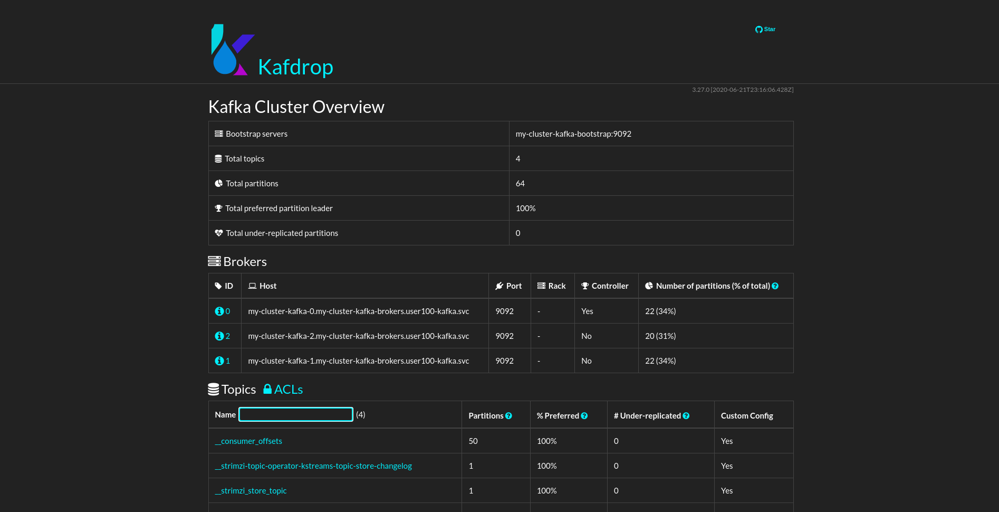

# Monitor your Kafka cluster using Kadrop UI

We all know the importance of Metrics in Production, its ability to help the Operation teams catch onto a problem before it occurs, alert them, and as a result improve out production uptime.  

Metrics in Red Hat AMQ can help us understand what is the state of Kafka cluster.
In this exercise, we will use AMQ Streams operator to deploy Kafka on Openshift, and expose its metrics to Kadrop UI.


## Table of Contents

- [Objective](#objective)
- [Diagram](#diagram)
- [Guide](#guide)
- [Takeaways](#takeaways)

# Objective

Getting to know better with our Kafka's monitoring possibilities: 

- Deploy `Kadrop` UI to monitor our cluster 
- Understand how we can view metrics to understand better our cluster's state and performance   

# Diagram


# Guide

## Step 1

 Click the `Add+` button in order to consume a resource from Openshift's marketplace. Pick the `Operator Backed` button in order to consume As-A-Service Kafka cluster. 

 Pick the `Kafka` resource and hit `Create` to start the deployment:  


## Step 2 

Hit the `Create` button in order to complete the installation (Make sure to seitch to `persistent-claim` and `deleteClaim` to consume persistent storage for both `Kafka` and `ZooKeeper`): 


In Addition, switch to the `YAML View` section and add the following line under the `Storage` section:

```bash
storage:
  type: persistent-claim
  size: 2Gi
  deleteClaim: true
```
## Step 3 

Veirfy that your Kafka cluster installation had been successful by using the `Project -> Pods` in the inventory: 


-   We have our `amq-streams-cluster-oprator` which is the amq-streams operator
-   We have 3 Kafka pod and 3 Zookeeper pods as stated in `spec.kafka.replicas` and `spec.zookeeper.replicas` accordingly
-   we also have an entity operator, which comprises of the topic operator and the User operator

## Step 4

Ensure that the Kafka nodes are indeed using an persistent volumes for storing the Kafka logDirs by using `Project -> PVCs` on the left tab: 


## Step 6

Let's create a Kafka topic using the `Add+ -> Operator Backed -> Kafka Topic -> Create` with the name `my-topic`: 


Make sure you leave the default values and hit the `Create` button. 

## Step 7

Validate that the created Kafka topic was created successfuly by using `get kt` command: 

```bash 
$ oc get kt
                                                                                
NAME       PARTITIONS   REPLICATION FACTOR
my-topic   12           3
```

The Kafka topic was created with 12 parititions and replication factor of 3. 

## Step 8

Let's create a Kafka user to interact with the created topic, move through the `KafkaUser` CR to verify that you understand how user management is handled in AMQ.

Copy this YAML, and paste it in `Add+ -> Operator Backed -> Kafka User` in order to create the `Kafka User` CR: 
 


Before you hit the `Create` button, switch to the `YAML View` section to verify you understand all the ACLs that is being given to our created user.

## Step 9

Now let's create a Kafka Producer that will write messages to our `my-topic` topic, and a consumer that will consume those messages via `Add+ -> YAML` 

```bash 
apiVersion: apps/v1
kind: Deployment
metadata:
  labels:
    app: hello-world-producer
  name: hello-world-producer
spec:
  replicas: 1
  selector:
    matchLabels:
      app: hello-world-producer
  template:
    metadata:
      labels:
        app: hello-world-producer
    spec:
      containers:
      - name: hello-world-producer
        image: strimzici/hello-world-producer:support-training
        env:
          - name: CA_CRT
            valueFrom:
              secretKeyRef:
                name: my-cluster-cluster-ca-cert
                key: ca.crt
          - name: USER_CRT
            valueFrom:
              secretKeyRef:
                name: my-user
                key: user.crt
          - name: USER_KEY
            valueFrom:
              secretKeyRef:
                name: my-user
                key: user.key
          - name: BOOTSTRAP_SERVERS
            value: my-cluster-kafka-bootstrap:9093
          - name: TOPIC
            value: my-topic
          - name: DELAY_MS
            value: "5000"
          - name: LOG_LEVEL
            value: "INFO"
          - name: MESSAGE_COUNT
            value: "5000"
```
Now let's create a Kafka consumer that will read messages from our `my-topic` topic via `Add+ -> YAML` :

```
apiVersion: apps/v1
kind: Deployment
metadata:
  labels:
    app: hello-world-consumer
  name: hello-world-consumer
spec:
  replicas: 1
  selector:
    matchLabels:
      app: hello-world-consumer
  template:
    metadata:
      labels:
        app: hello-world-consumer
    spec:
      containers:
      - name: hello-world-consumer
        image: strimzici/hello-world-consumer:support-training
        env:
          - name: CA_CRT
            valueFrom:
              secretKeyRef:
                name: my-cluster-cluster-ca-cert
                key: ca.crt
          - name: USER_CRT
            valueFrom:
              secretKeyRef:
                name: my-user
                key: user.crt
          - name: USER_KEY
            valueFrom:
              secretKeyRef:
                name: my-user
                key: user.key
          - name: BOOTSTRAP_SERVERS
            value: my-cluster-kafka-bootstrap:9093
          - name: TOPIC
            value: my-topic
          - name: GROUP_ID
            value: my-group
          - name: LOG_LEVEL
            value: "INFO"
          - name: MESSAGE_COUNT
            value: "5000"
```
## Step 10

Verify that you consumer and producer are working as expected, by printing their logs. 

## Step 11

Now Let's deploy `Kadrop` which is a simple UI for Kafka clusters. We'll see how we can browse our entire Kafka configuration, Monitor our cluster and even view the meesages landing in our created Topic. 

In order to do so, We'll have to create three components, The first one is the deployment itself for the `Kadrop` pod:

```bash
apiVersion: apps.openshift.io/v1
kind: DeploymentConfig
metadata:
  name: kafdrop
spec:
  selector:
    app: kafdrop
  replicas: 1
  template:
    metadata:
      labels:
        app: kafdrop
    spec:
      containers:
        - name: kafdrop
          image: obsidiandynamics/kafdrop:latest
          ports:
            - containerPort: 9000
          env:
          - name: KAFKA_BROKERCONNECT
            value: "my-cluster-kafka-bootstrap:9092"
          - name: JVM_OPTS
            value: "-Xms32M -Xmx64M"
          - name: SERVER_SERVLET_CONTEXTPATH
            value: "/"
```

Now that we have the `Pod` running, We'll deploy a `Service` that will help up interact within the cluster itself: 

```bash
apiVersion: v1
kind: Service
metadata:
  name: kafdrop
spec:
  selector:
    app: kafdrop
  ports:
    - protocol: TCP
      port: 9000
      targetPort: 9000
```

Now, We'll create a `Route` so we could access the `Kadrop` UI outside of the Openshift cluster:

```bash
kind: Route
apiVersion: route.openshift.io/v1
metadata:
  name: kafrop
spec:
  subdomain: ''
  to:
    kind: Service
    name: kafdrop
    weight: 100
  port:
    targetPort: 9000
  wildcardPolicy: None
```

## Step 12

Make sure you can Access the `Kadrop` UI by pressing the arrow on the right when looking at the `Topology` view: 




## Step 13

Play with the number of your consumers and producers to see how the data changes in your `Kadrop` dashboards.

## Step 14

Delete the exercise's resources using:
*  `Topology -> hello-producer -> Delete Deployment`
*  `Topology -> hello-consumer -> Delete Deployment`
*  `Search -> Resources -> KafkaUser -> Delete`
*  `Search -> Resources -> Kafka -> Delete`

Make sure you have nothing in the `Topology View`.

# Complete

Congratulations! You have completed the second exercise :)

---
[Click Here to return to the AMQ streams Workshop](../README.md)
