# Exercise 1 - Exploring Basic Capabillities of the ECK Operator 

## Table of Contents

- [Objective](#objective)
- [Diagram](#diagram)
- [Guide](#guide)
- [Takeaways](#takeaways)

# Objective

Explore and understand the ECK operator, In this exercise we will be focusing on: 
- Understanding how we can ease Day1 and Day2 operations using the ECK operator
- Create our own `Elasticsearch` cluster backed up by `Kibana`
- Getting familiar with the different installation components 

# Diagram

Make sure you connect to the cluster before starting this exercise! 

# Guide

## Step 1

Login to the `Openshift Console` and create a project using the `Project` tab on te left. Hit the `Create a new project` button and create your own project:

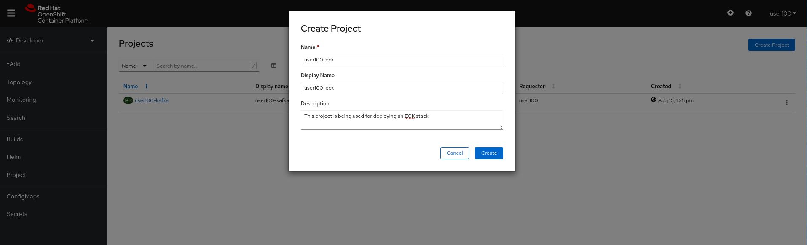

## Step 2

 Click the `Add+` button in order to consume a resource from Openshift's marketplace. Pick the `Operator Backed` button in order to consume As-A-Service `Elasticsearch` cluster. 

 Pick the `Elasticsearch Cluster` resource and hit `Create` to start the deployment:  

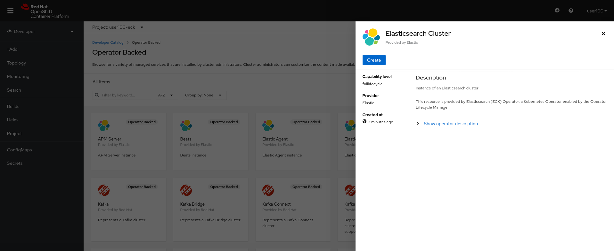

## Step 3 

Switch to `YAML View` under the `Create Elasticsearch` section, and make sure you understand each one of the values presented in the YAML. 

Switch the number of `Elasticsearch` instances to 1 and hit the `Create` button on the down left in order to complete the installation: 

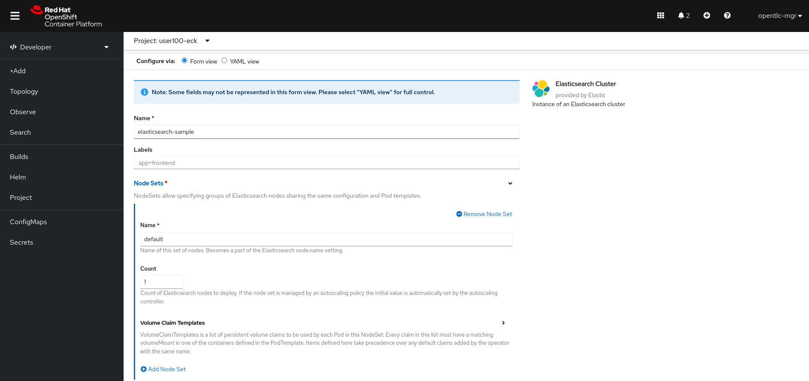

## Step 4 

Make sure your `Elasticsearch` cluster was successfully installed and that you can see all of its compnents: 

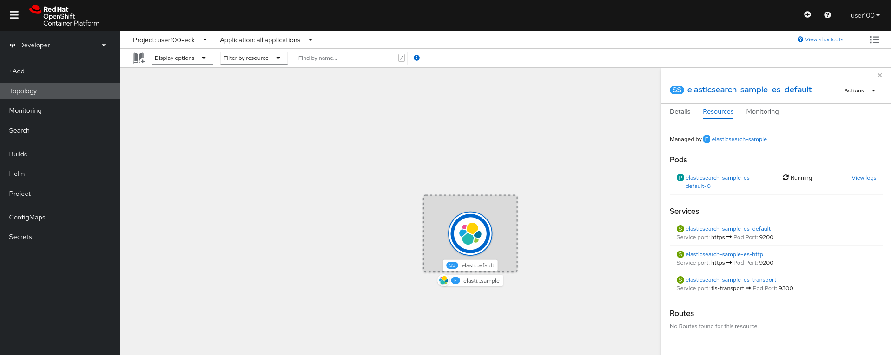

## Step 5 

Veirfy that your `Elasticsearch` cluster installation had been successful by using the `Project -> Pods` in the inventory: 

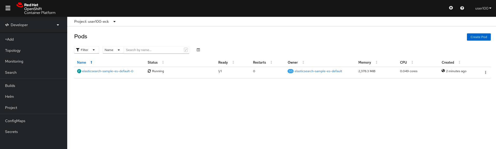

Here you can see that you have deployed your `Elasticsearch` instance that can be scaled out/in whenever needed, we'll see later on how we can scale our cluster easily. 

## Step 6 

Ensure that the your node has attached a PVC coming from our default `StroageClass` using `Project -> PVCs` on the left tab: 

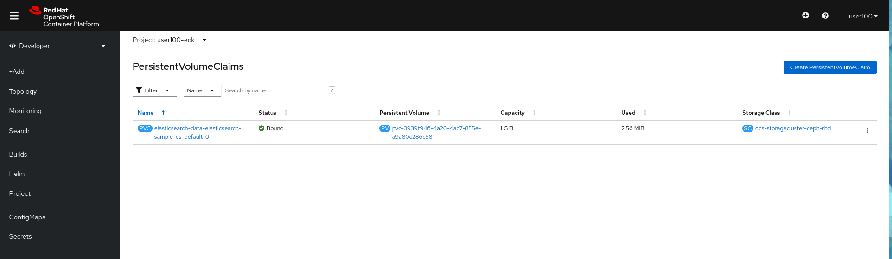

## Step 7 

In order to test our `Elasticsearch` cluster, Let's create a `Route` to expose our cluster's traffic outside of the cluster. 

In the `Openshift Console`, hit `Project -> Routes` and then make sure you hit the `Create Route` button. 

Call your route `elastic-http`, make sure you pick the right service to point to (in our case it's `elasticsearch-sample-es-http`).

Port redirection is picked by default, use a `Passthrough Secured Route` as presented in the following image: 

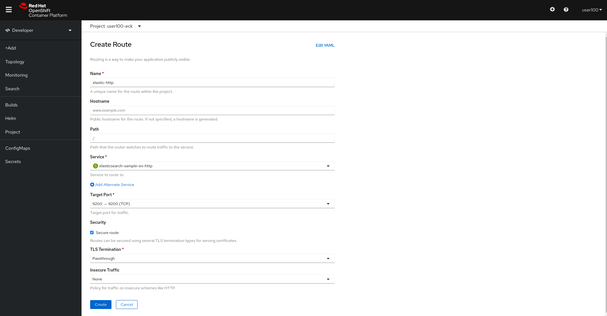

Hit the `Create` button and move on. 

## Step 8 

After creating your `Route`, Make sure you can see its `Location` and that its status is in `Accepted` mode. 

Go back to your `Topology View` and click the arrow (`Open URL`) the `Elasticsearch` instance has on the top right: 

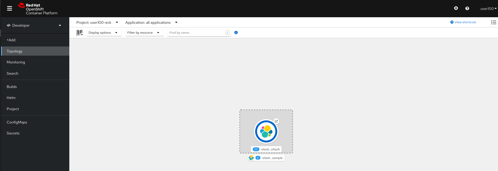

Make sure you leave the default values and hit the `Create` button. 

### Pause To Think
*Question - It seems like our Elasticsearch requires authentication, where can we find it?*

## Step 9 

As we are using an operator, lots of the things are created automatically and we don't need to configure them. 

The credentials for example for the `Elasticsearch` instance are created automatically by the operator an can be found in the `Secrets` tab on the left tab.

Under `Secrets`. search for the `elasticsearch-sample-es-elastic-user` secret, click it and press the `Copy To Clipboard` button to copy the password:

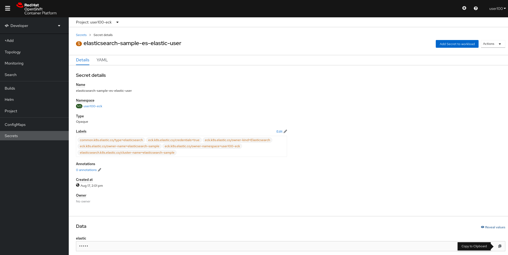

## Step 10 

After you have copied the password, make sure you login to the authentication page you got earlier using the `elastic` username and the password you've copied one second ago: 

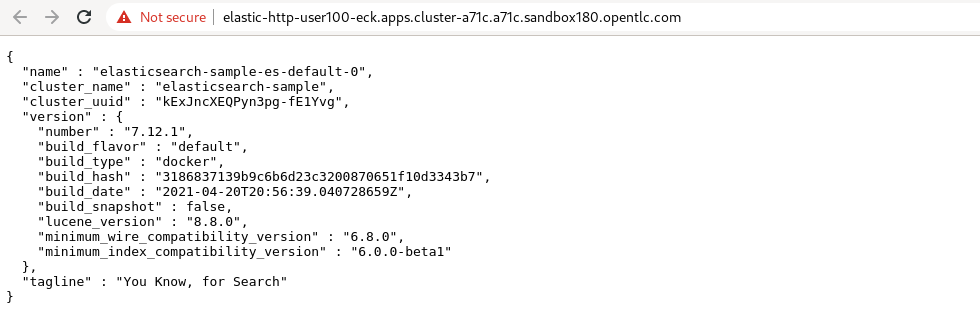

Great! we have accessed our Elastic API and we'll be able to ingest data later on.

## Step 11

Now let's create our `Kibana` instance, so we'll be able to visualize the data we ingest to `Elasticsearch`. 

Click the `Add+` button in order to consume a resource from Openshift's marketplace. Pick the `Operator Backed` button in order to consume a `Kibana` instance. 

 Pick the `Kibana` resource and hit `Create` to start the deployment:  

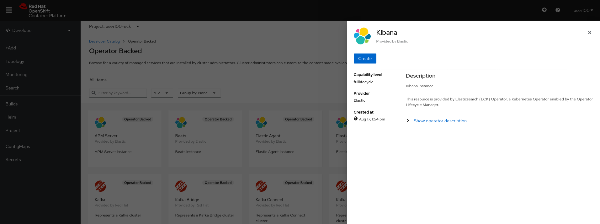

Switch to the `YAML View`, make sure you understand every field the YAML presents to you. 

### Pause To Think
*Question - How does our `Kibana` instance knows which `Elastic` to refer to?*

## Step 12

Hit the `Create` button on the `Create Kibana` section that was opened to create our instance.

## Step 13

Make sure both `Elastic` and `Kibana` are up and ready to use by navigating to `Project -> Pods`: 

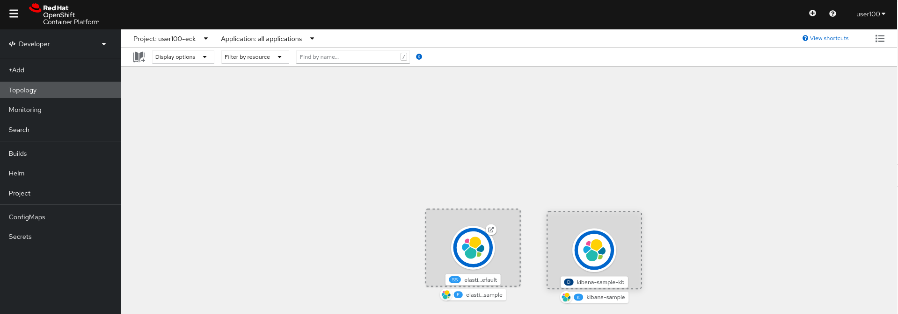

## Step 14 

In order to test our `Kibana` cluster, Let's create a `Route` to expose our cluster's traffic outside of the cluster. 

In the `Openshift Console`, hit `Project -> Routes` and then make sure you hit the `Create Route` button. 

Call your route `kibana-http`, make sure you pick the right service to point to (in our case it's `kibana-sample-es-http`).

Port redirection is picked by default, use a `Passthrough Secured Route` as presented in the following image: 

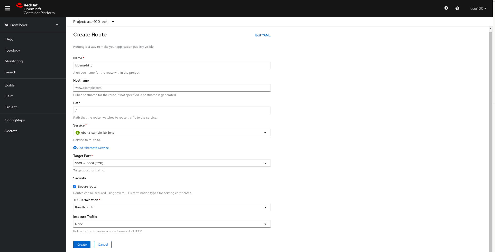

Hit the `Create` button and move on. 

## Step 15 

Again, verify that you have the correct status for your `Route` and try to navigate to it. 

**Important! make sure you copy the `Elasticsearch` password as before as we need it to login to `Kibana`**

Login to `Kibana`:

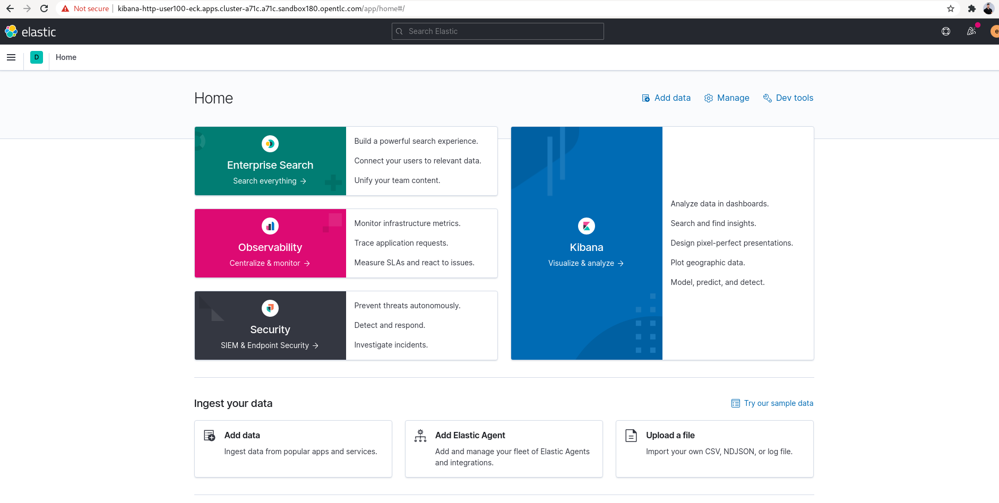

# Complete

Congratulations! You have completed the first exercise :)

---
[Click Here to return to the AMQ streams Workshop](../README.md)
