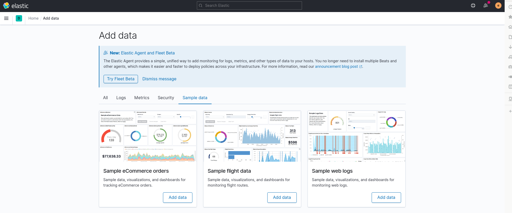
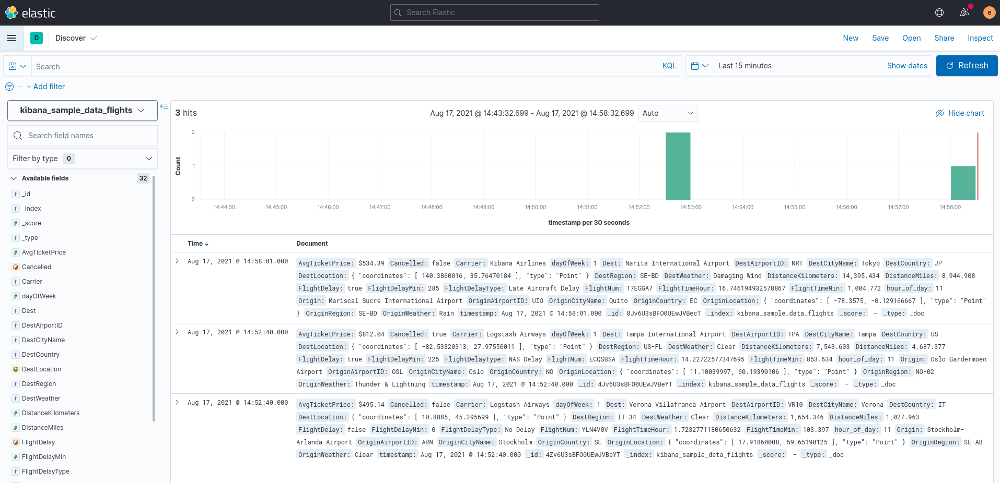
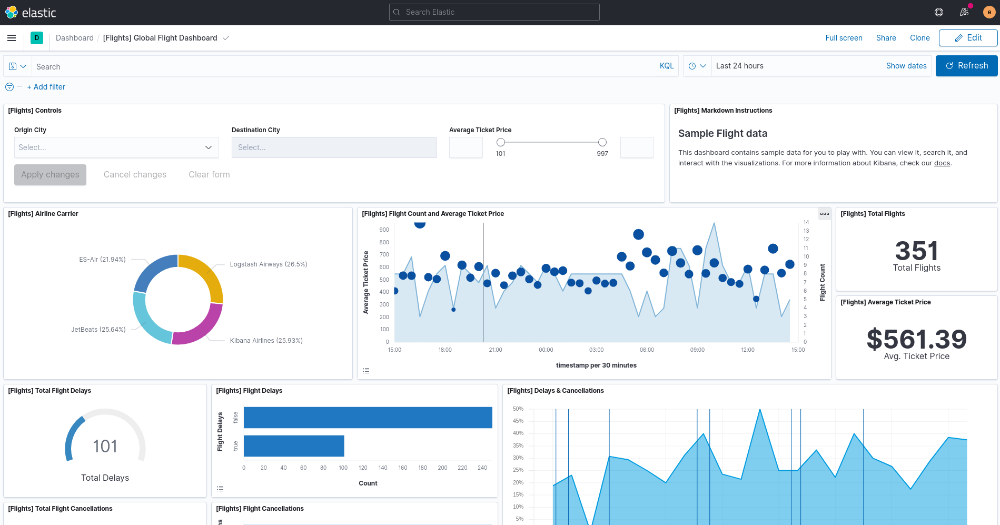
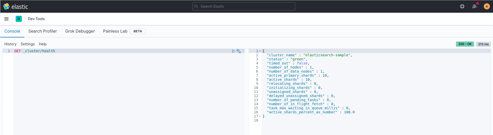
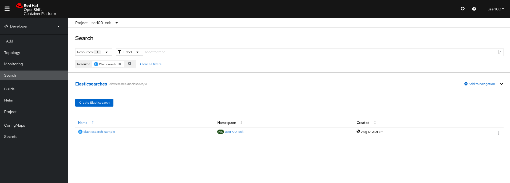
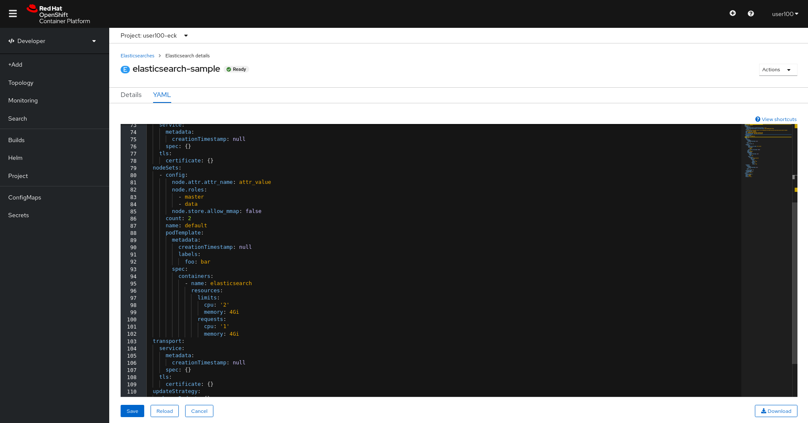
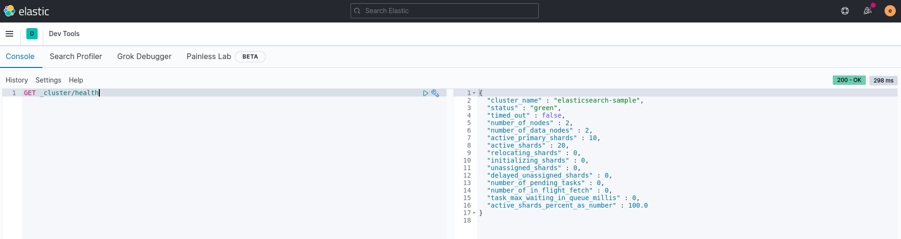
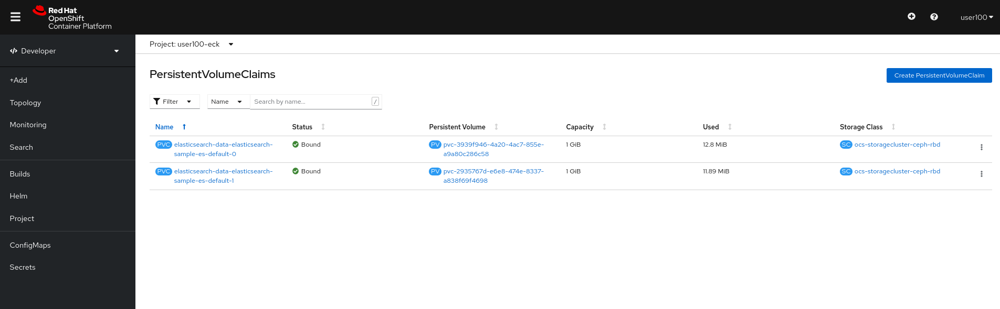
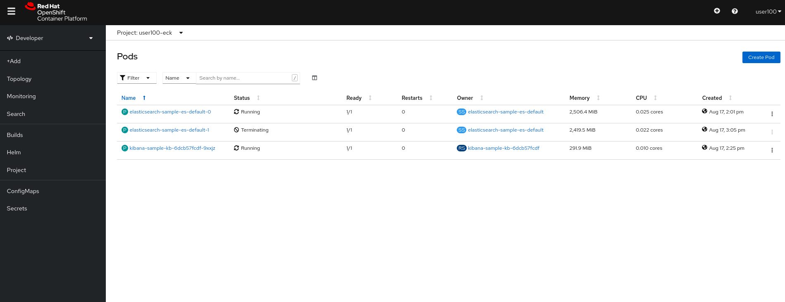
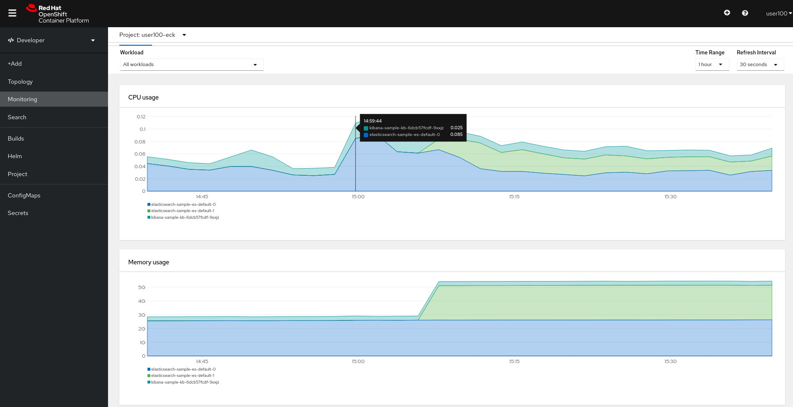

# Exercise 5 - Data Integrity, Ingestion & Visalization 

## Table of Contents

- [Objective](#objective)
- [Diagram](#diagram)
- [Guide](#guide)
- [Takeaways](#takeaways)

# Objective

Explore and understand the ECK operator, In this exercise we will be focusing on: 
- See how we can ingest data to our `Elasticsearch` instance using `Kibana`
- Explore and visualize the data from `Kibana`
- Expand/Shrink the cluster in an automated way, without adding configuration burden 

# Diagram

Make sure you connect to the cluster before starting this exercise! 

# Guide

## Step 1

From your `Kibana`'s default page, Make sure you hit the `Add Data -> Sample data` button in order to ingest data into your `Elasticsearch` instance: 

Pick the `sample flight data` and wait for it to be loaded into your own cluster. 

## Step 2

Make sure you can navigate to the `Discover` section, where you can see the information that was added to your created index: 

## Step 3 

Navigate to the `Dashboard` section under the `Kibana` tab on the left, and make sure that you understand how data was written and how it was pulled from out `Elasticsearch` instance: 

## Step 4 

Navigate to the `Dev Tools` section and try to fetch the current cluster status to verify its in `Green` status: 

## Step 5 

Once you have verified that your cluster is in healthy state, let's scale our cluster to two nodes and see what happens. To do so, please open the `Openshift Console`, navigate to `Search -> Elasticsearch`. 

Once you have found your instance, click on the `:` button in the right corner and edit your `Elastcsearch Node Count`: 

**Important! Make sure you are overwriting the current value of `count: 1` with  `count: 2`**

Now click `Save` and go back to your `Topology View`. 

Verify that you now have two `Elasticsearch` instances. 

## Step 6 

Let's run the cluster helath query once again, get back to your `Dev Tools` view in the `Kibana` UI and run the query once again: 

## Step 6 

Let's see if a new `PVC` was created for the new node that was added recently: 

Great! We have the second node added automatically! 

A bit on the advantages we see here: 
- The `Elasticsearch` node was created automatically with all the needed configuration 
- A new storage attachment (`PVC`) was created automatically without us doing anything 
- The node was added to the cluster automatically and replicated all the needed data 

## Step 8 

In order to test our cluster's abillity in having failures let's try to delete one of the `Elasticsearch` pods: 

Go back to your `Topology View`, click the `Elasticsearch` instance, navigate to `Details`, click on one of the pods and delete it: 

Wait and make sure the a new one is created and is added as expected to the cluster by testing the cluster's health once again. 

## Step 9 

Now let's see how we can monitor our infrastructure using the existing `Prometheus & Grafana` stack Openshift Provides. 

In the `Openshift Console`, navigate to `Monitoring` and change the time range to `1 hour`: 

Make sure you understand the following: 
- We see that on start, we had only two pods which reflects with the number of colors we see on the graph 
- We see that the `Memory Usage` was multipled by two, which is reasonable as we have added another `Elasticsearch` instance 

# Complete

Congratulations! You have completed the fifth exercise :)

---
[Click Here to return to the Workshop Index](../README.md)
